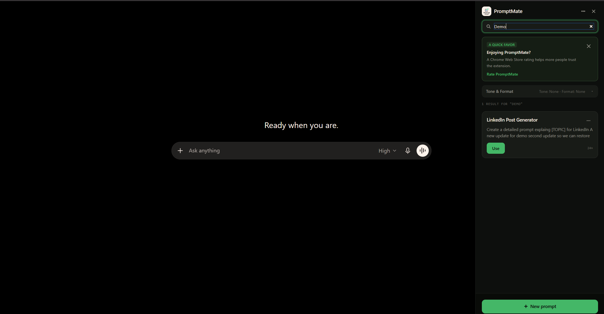

<p align="center">
  
</p>

<h1 align="center">PromptMate</h1>

<p align="center">
  <em>Your prompts. One click away. On every AI chat you use.</em>
</p>

<p align="center">
  <a href="https://chromewebstore.google.com/detail/oknglgpcglngpaobpjndcaaljdchmgai"></a>
  
  
  
  <a href="https://github.com/jitangupta/PromptMate"></a>
</p>

---

Your best prompts live in a notes file called `prompts-final-v2.txt`. Every time you need one, you alt-tab, hunt, copy, paste, hand-edit the tone, and retype the details. Then you switch from ChatGPT to Claude and do it all again.

PromptMate puts your prompt library inside the chat — the same sidebar, the same prompts, on 15 AI platforms.

<p align="center">
  
</p>

## Before / after

**Without:** notes app → search → copy → paste → fix the tone by hand → replace last week's topic → send.

**With:** open the sidebar, click **Use**. Variables pop a fill-in dialog, your tone and format presets are applied, and the composed prompt lands in the chat's input field — with the send button enabled, ready to go.

## Features

- **Prompt library** — save, edit, pin, and search prompts in a sidebar that lives alongside the chat
- **Groups + group instructions** — organize prompts into named groups; a group's shared instruction is automatically prepended to every prompt inside it
- **Variables** — embed `{{placeholders}}` in any prompt; a fill-in dialog appears before insert
- **Tone + Output Format presets** — compose the prompt body with reusable modifiers (professional, concise, bullet list, JSON, …)
- **User context** — set your role and background once; it's appended to every outgoing prompt on every platform
- **Version history** — every edit is versioned, with word-level diffs between any two versions
- **Trash / restore** — deleted prompts are soft-deleted and recoverable
- **Google Drive sync** — prompts sync across devices via your own Drive; local storage is a cache, so it works offline
- **No servers, no tracking** — there is no PromptMate backend; the extension talks only to the sites you're already using

## Supported platforms

[ChatGPT](https://chatgpt.com) · [Claude](https://claude.ai) · [Gemini](https://gemini.google.com) · [Grok](https://grok.com) (grok.com + x.com/i/grok) · [Perplexity](https://www.perplexity.ai) · [Microsoft Copilot](https://copilot.microsoft.com) · [DeepSeek](https://chat.deepseek.com) · [Mistral Le Chat](https://chat.mistral.ai) · [Meta AI](https://www.meta.ai) · [Qwen Chat](https://chat.qwen.ai) · [Kimi](https://kimi.com) · [Poe](https://poe.com) · [HuggingChat](https://huggingface.co/chat) · [Google AI Studio](https://aistudio.google.com) · [Pi](https://pi.ai)

Your prompt for one platform works on all of them — the sidebar is identical everywhere.

> [!NOTE]
> PromptMate can only insert where the platform shows you a chat composer. Some platforms require you to be signed in first: **DeepSeek, Grok (X account), Gemini, Mistral Le Chat, Meta AI, Poe, and Google AI Studio**. Perplexity, Qwen Chat, and HuggingChat work logged out (with platform limits); Copilot and Pi usually do, but may show sign-in or onboarding gates. Meta AI is also region-gated in some countries.

## Install

### Chrome Web Store

Install from the [Chrome Web Store listing](https://chromewebstore.google.com/detail/oknglgpcglngpaobpjndcaaljdchmgai). The store build can lag a release behind while a version is in review.

### From source

```bash
git clone https://github.com/jitangupta/PromptMate.git
cd PromptMate
npm install
npm run build
```

Then in Chrome:

1. Go to `chrome://extensions`
2. Enable **Developer mode** (top-right toggle)
3. Click **Load unpacked** and select the repo root

The extension appears on each supported chat site as a floating **PromptMate** button. On `x.com` and `huggingface.co` it is path-scoped (`/i/grok`, `/chat`) — load or refresh those pages directly for the button to appear.

## How it works

One shared sidebar core owns the whole feature surface; each platform gets a ~20-line adapter with a fallback-ordered list of composer selectors. Insertion is dual-path — native value setter + `InputEvent` for plain textareas, a synthetic paste event for rich contenteditable editors — so the host's framework actually registers the text and enables its send button, instead of showing a filled box it doesn't believe in. Details in [CONTRIBUTING.md](CONTRIBUTING.md).

## Privacy

PromptMate runs no backend. Your prompts are stored in your own Google Drive (local storage is a cache), and no PromptMate server ever sees your data. The extension requests host permissions only for the chat sites it injects into.

**Why does Chrome say it can "read data on x.com"?** Chrome grants host permissions per origin, so it lists the whole site — but where a site hosts more than the chat (x.com, huggingface.co), the extension's content scripts only load on the chat pages (`/i/grok`, `/chat`).

## FAQ

**Do I need an account?**
A Google sign-in, for Drive sync — that's what makes your library follow you across devices. There is no PromptMate account.

**The button vanished from a site that worked yesterday.**
The host shipped a redesign and broke the composer selectors — the most common failure mode for any injection extension. [Open an issue](https://github.com/jitangupta/PromptMate/issues) with the site name; selector fixes are usually small and fast.

**Will you add [my favorite AI chat]?**
Probably — adding a host is a ~20-line adapter. Open an issue, or see [CONTRIBUTING.md](CONTRIBUTING.md) and add it yourself.

## Contributing

See [CONTRIBUTING.md](CONTRIBUTING.md) for dev setup, build commands, and the kind of bugs most likely to need triage (hint: host-site DOM selectors break when ChatGPT, Claude, or DeepSeek ships a redesign).

## Agent QA

PromptMate is tested with a dedicated **[PromptMate Agent QA Harness](https://github.com/jitangupta/promptmate-agent-qa-harness)** — 86 test cases across 18 categories, executed by AI agents in real browser sessions on Claude, ChatGPT, DeepSeek, and Kimi.

The harness covers prompt search, tone and format modifiers, group libraries, variable placeholders, version history, trash/restore flows, cloud sync, and platform-specific injection behavior. Test results, development handoff notes, and reports from live QA runs are published there.

This is a worked example of the generalized **[Agent QA Harness](https://github.com/jitangupta/agent-qa-harness)** pattern — a reusable, file-based template for using AI agents as browser QA operators on any product.

## Changelog

Release notes live in [CHANGELOG.md](CHANGELOG.md).

## License

[MIT](LICENSE) © Jitan Gupta

## Star History

<a href="https://www.star-history.com/jitangupta/PromptMate#history">
  <picture>
    <source media="(prefers-color-scheme: dark)" srcset="https://api.star-history.com/chart?repos=jitangupta/PromptMate&type=Date&theme=dark" />
    <source media="(prefers-color-scheme: light)" srcset="https://api.star-history.com/chart?repos=jitangupta/PromptMate&type=Date" />
    
  </picture>
</a>
