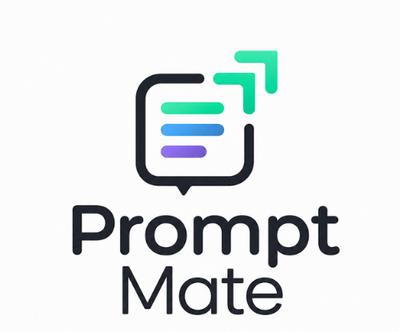

<p align="center">
  
</p>

<h1 align="center">PromptMate</h1>

<p align="center">Your prompts. One click away.</p>

<p align="center">
  <a href="https://chromewebstore.google.com/detail/oknglgpcglngpaobpjndcaaljdchmgai">
    
  </a>
  &nbsp;
  <a href="https://github.com/jitangupta/PromptMate">
    
  </a>
</p>

PromptMate is a Chrome extension that injects a prompt-management sidebar into [ChatGPT](https://chatgpt.com), [Claude](https://claude.ai), [DeepSeek](https://chat.deepseek.com), and [Kimi](https://kimi.com). Compose prompts from a reusable body plus selectable **Tone** and **Output Format** presets, then insert them into the host chat with a single click.

## Features

- **Prompt library** — save, edit, and organize prompts in a sidebar alongside the chat
- **Tone + Output Format presets** — compose prompts by combining a body with reusable modifiers (formal, concise, bullet list, JSON, etc.)
- **One-click insert** — sends the composed text straight into the ChatGPT, Claude, DeepSeek, or Kimi input field
- **Local-first** — prompts are stored in `chrome.storage.local` on your machine (Drive sync coming soon)
- **No servers, no tracking** — the extension talks only to the host sites you're already using

## Install

### From source (current path while pre-release)

```bash
git clone https://github.com/jitangupta/PromptMate.git
cd PromptMate
npm install
npm run build
```

Then in Chrome:

1. Go to `chrome://extensions`
2. Enable **Developer mode** (top-right toggle)
3. Click **Load unpacked** and select the repo root

The extension appears on `chatgpt.com`, `claude.ai`, `chat.deepseek.com`, and `kimi.com` as a **PromptMate** floating button.

### From Chrome Web Store

Install from the [Chrome Web Store listing](https://chromewebstore.google.com/detail/oknglgpcglngpaobpjndcaaljdchmgai).

## Privacy

PromptMate does not run any backend. Your prompts are stored in your browser's local extension storage and (once Drive sync ships) in your own Google Drive. The extension has host permissions only for `chatgpt.com`, `claude.ai`, `chat.deepseek.com`, and `kimi.com` — the four sites it injects the sidebar into.

## Contributing

See [CONTRIBUTING.md](CONTRIBUTING.md) for dev setup, build commands, and the kind of bugs most likely to need triage (hint: host-site DOM selectors break when ChatGPT, Claude, or DeepSeek ships a redesign).

## Agent QA

PromptMate is tested using a dedicated **[PromptMate Agent QA Harness](https://github.com/jitangupta/promptmate-agent-qa-harness)** — 86 test cases across 18 categories, executed by AI agents in real browser sessions on Claude, ChatGPT, DeepSeek, and Kimi.

The harness covers prompt search, tone and format modifiers, group libraries, variable placeholders, version history, trash/restore flows, cloud sync, and platform-specific injection behavior. Test results, development handoff notes, and reports from live QA runs are published there.

This is a worked example of the generalized **[Agent QA Harness](https://github.com/jitangupta/agent-qa-harness)** pattern — a reusable, file-based template for using AI agents as browser QA operators on any product.

## License

[MIT](LICENSE) © Jitan Gupta
